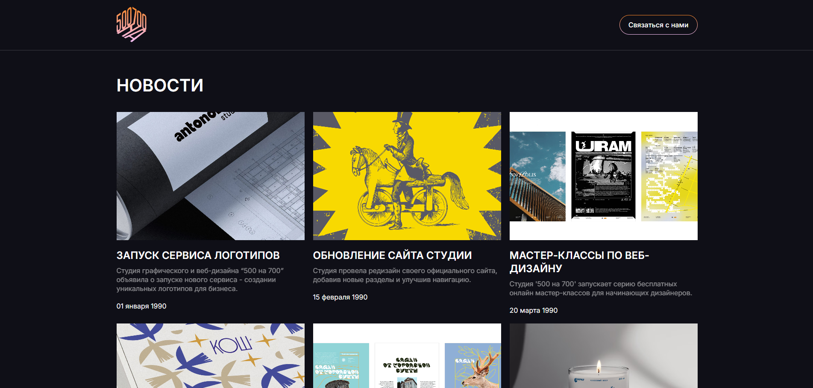
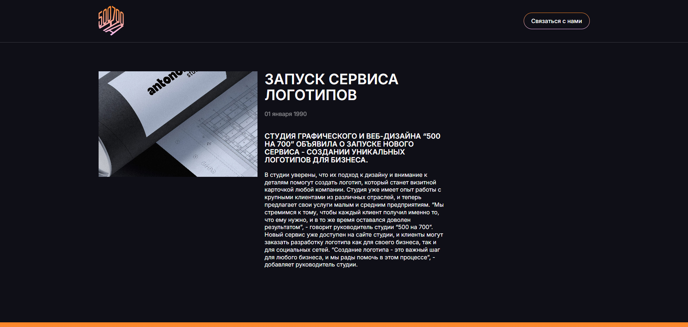

# 📰 News Portal (Test Assignment for 500na700)

Реализация тестового задания на позицию Frontend-разработчика. Проект представляет собой SPA (Single Page Application) новостного портала с детальной страницей статьи и формой обратной связи.

**Live Demo:** [https://500na700-test-assignment.vercel.app/](https://500na700-test-assignment.vercel.app/)  
**Repository:** [https://github.com/kirikov-ra/500na700-test-assignment.git](https://github.com/kirikov-ra/500na700-test-assignment.git)

---

## Реализация требований ТЗ

Проект выполнен строго в соответствии с поставленной задачей, без избыточного overengineering, с соблюдением современных стандартов разработки.

- [x] **Шапка:** Всегда закреплена при скролле (Sticky Header)  
- [x] **Блок новостей:** Данные подгружаются асинхронно порционально из `public/data/news.json` через `fetch` с имитацией задержки сети (`setTimeout`)  
- [x] **Детальные страницы:** Реализован динамический роутинг. Данные запрашиваются асинхронно по ID статьи  
- [x] **Форма обратной связи:**  
  - Валидация обязательных полей  
  - Строгая валидация Email (RegEx)  
  - Маска телефона реализована нативно (кастомный форматтер), без сторонних библиотек  
  - Вывод данных в `console.log` при успешной отправке  
- [x] **Адаптивность:** Mobile-first подход (Desktop + Mobile стадии)  
- [x] **Стек:** React 18, TypeScript (Strict), SCSS Modules  
- [x] **UI:** Без сторонних UI-китов (MUI, AntD и т.д.), все компоненты написаны с нуля  

---

## 🏗 Архитектура (Feature-Sliced Design)

Проект спроектирован с использованием методологии FSD для обеспечения предсказуемости, масштабируемости и переиспользуемости модулей:

```
src/
├── app/        # Инициализация приложения (провайдеры, роутер)
├── pages/      # Страницы (NewsListPage, ArticleDetailPage)
├── widgets/    # Самостоятельные блоки (Header, NewsList, FeedbackForm)
├── entities/   # Бизнес-сущности (NewsCard, типы Article, API-моки)
└── shared/     # Переиспользуемый код (UI-kit: Button, Input; utils: validators, глобальные стили)
```
---

## ⚙️ Инженерные решения

- **Strict TypeScript:** Типизированы все пропсы, API-ответы, события форм и хуки  
- **Native React:** Управление состоянием через нативные (`useState`, `useEffect`) и кастомные хуки. Глобальные стейт-менеджеры не использовались (YAGNI)  
- **SCSS Modules:** Изоляция стилей на уровне компонентов. Использование CSS-переменных для темизации и констант (цвета, брейкпоинты)  

---

## 🚀 Запуск проекта

Для запуска проекта локально потребуется Node.js v18+.

1. **Клонирование репозитория**
```bash
git clone https://github.com/kirikov-ra/500na700-test-assignment.git
````

2. **Установка зависимостей**

```bash
npm install
```

3. **Запуск dev-сервера (Vite)**

```bash
npm run dev
```

Приложение будет доступно по адресу: [http://localhost:5173](http://localhost:5173)

---

## 🧪 Тестирование

Несмотря на то, что тесты не требовались, критически важная бизнес-логика покрыта unit- и интеграционными тестами для демонстрации культуры разработки.

**Инструменты:** Vitest + React Testing Library

**Запуск тестов:**

```bash
npm run test
```

**Что протестировано:**

* Валидаторы (`isValidEmail`, нативная маска `formatPhoneMask`)
* Интеграционный тест `FeedbackForm`:

  * рендер
  * валидация пустых полей
  * работа маски при вводе
  * успешная отправка при валидных данных

---

## ✨ Скриншоты и ключевые фичи

**Ключевые фичи:**

* SPA на React с динамическим роутингом
* Mobile-first адаптивный дизайн
* Строгая типизация на TypeScript (strict)
* Кастомная нативная маска телефона без библиотек
* Асинхронная загрузка новостей с имитацией задержки сети
* Полностью собственные UI-компоненты, без сторонних библиотек
* Feature-Sliced Design для масштабируемости и переиспользуемости
* Unit- и интеграционные тесты для критических блоков

**Скриншоты интерфейса:**




